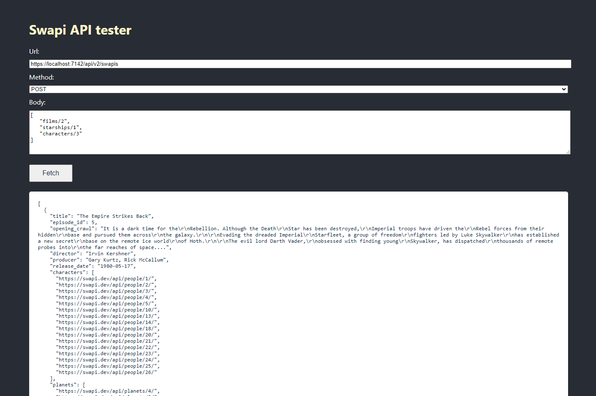
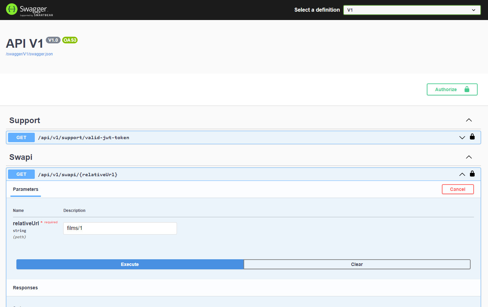

# SwapiProxy API

## How to run

The project has been implemented using Visual Studio and so can be started as such by using the API as the Start up project. This will also run Swagger in the Development environment.

The command `dotnet run` can also be used when within the project directory.

### React SPA

### Swagger

## Implemented features

- An endpoint to proxy a single call to the proxy API
- An endpoint to aggregate multiple calls to the proxy API in a single call to your API
- Rate limiting calling the API and the downstream SWAPI API
- Bearer token authorization
- Unit tests
- Integration tests
- Postman collection
- Versioned and authorized swagger
- Small simple react SPA to test
- GitHub actions used to build and test the service in the pipeline.

## How this is implemented

- There are three different methods of testing the API, Swagger, Postman and a simple react application.
- The single call endpoint is in version 1 of the API and the aggregate endpoint is in version 2.
- The proxy domain handles all the logic and is implemented in a manner that is independant of what downstream API is used.
- A JWT bearer token is required to hit the endpoints. A support controller has been added in order to generate this bearer token for testing purposes.
- The `AspNetCoreRateLimit` package is used in order to add IP rate limiting to the project. This can be configured within `appsettings.json`.
- Polly is utilised in order to add a simple rate limiter when hitting the SWAPI API.
- Unit tests are included testing the domain logic.
- Integration tests test both the API endpoints.
- A simple postman collection is found with `/Postman`.
- A versioned implementation of Swagger has been added for testing of the API. The bearer token can be retrieved from the support endpoint and added in the Authorization modal.
- A simple custom react application has been implemented in order to further test the API. Three inputs are given to query either endpoint.

## React SPA

- The `npm start` command within `swapi-proxy-web-app` can be ran to start the React SPA. The API must also be running.
- A full URL, the http method and the body of the request must be given within the inputs.
- The result of the request will be displayed below these inputs.

## Endpoints

### V1

- Swapi
    - GET: `/api/v1/swapi/[RELATIVE_URL]`
- Support
    - GET: `/api/v1/support/valid-jwt-token`

### V2

- Aggregate Swapi
   - POST: `/api/v2/swapis`

## Improvements/further work

- Caching on endpoints such as the single swapi requester.
- More consideration for paths outside of the happy paths.
- A lot more test coverage.
- Better performance testing.
- Better validation of the string passed in to the endpoints.
- Further improvements to the pipeline including no direct push to main and further test checks.
- Polly better utilised in order to include more policies when querying the downstream API.
- The bearer token should be given a lifetime rather than lasting forever.
- A `POST` request is used in order for a body to be passed to the aggreate swapi controller even though is getting data. This may be better suited implemented differently such as a `GET` with a base64 encoded query string.
- Proxies can be imlemented via a middleware though this would make the aggregated queries complex.